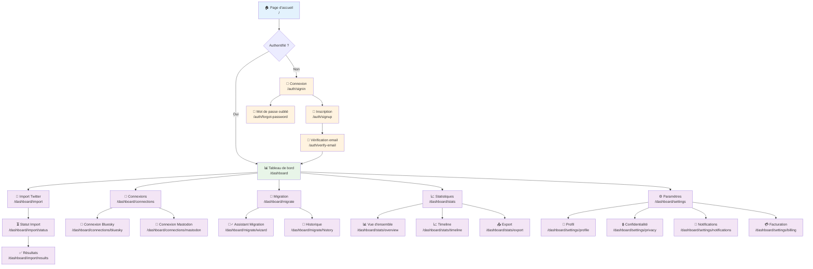

# Structure des Pages - OpenPortability

## Architecture des Pages Next.js

L'application utilise Next.js 15 avec App Router pour une structure moderne et performante.

```
src/app/
├── (auth)/              # Groupe de routes authentifiées
├── (dashboard)/         # Groupe de routes tableau de bord
├── api/                 # API Routes
├── globals.css          # Styles globaux
├── layout.tsx           # Layout racine
├── loading.tsx          # Composant de chargement
├── not-found.tsx        # Page 404
└── page.tsx             # Page d'accueil
```

## Diagramme de Navigation



## Pages Détaillées

### 1. Pages Publiques

#### Page d'Accueil (`/`)
**Composants:**
- Hero section avec proposition de valeur
- Fonctionnalités principales
- Témoignages utilisateurs
- Call-to-action inscription

**Métadonnées SEO:**
```tsx
export const metadata = {
  title: 'OpenPortability - Migrez vos données Twitter',
  description: 'Importez vos données Twitter et migrez vers Bluesky, Mastodon facilement.',
  keywords: ['twitter', 'migration', 'bluesky', 'mastodon', 'données sociales']
}
```

#### Page À Propos (`/about`)
- Mission et vision
- Équipe
- Technologie utilisée
- Open source

#### Page Confidentialité (`/privacy`)
- Politique de confidentialité
- Gestion des données
- Cookies et tracking

### 2. Pages d'Authentification

#### Connexion (`/auth/signin`)
**Composants:**
- Formulaire email/mot de passe
- Connexion OAuth (Google, GitHub)
- Lien vers inscription
- Récupération mot de passe

**Validation:**
```tsx
const signinSchema = z.object({
  email: z.string().email(),
  password: z.string().min(8)
})
```

#### Inscription (`/auth/signup`)
**Composants:**
- Formulaire inscription
- Validation en temps réel
- Conditions d'utilisation
- Redirection post-inscription

#### Vérification Email (`/auth/verify-email`)
- Message de confirmation
- Renvoi d'email
- Redirection automatique

### 3. Tableau de Bord Principal

#### Dashboard (`/dashboard`)
**Layout:**
```tsx
export default function DashboardLayout({
  children,
}: {
  children: React.ReactNode
}) {
  return (
    <div className="flex h-screen">
      <Sidebar />
      <main className="flex-1 overflow-auto">
        <Header />
        {children}
      </main>
    </div>
  )
}
```

**Composants:**
- Sidebar de navigation
- Header avec profil utilisateur
- Widgets de statut
- Raccourcis actions

### 4. Import de Données

#### Import Twitter (`/dashboard/import`)
**Composants:**
- Zone de drag & drop
- Validation de fichier
- Barre de progression
- Historique des imports

**États:**
```tsx
type ImportState = 
  | 'idle'
  | 'uploading'
  | 'validating'
  | 'processing'
  | 'completed'
  | 'error'
```

#### Statut Import (`/dashboard/import/status`)
- Progression en temps réel
- Détails par étape
- Logs d'erreur
- Actions de retry

### 5. Connexions Sociales

#### Connexions (`/dashboard/connections`)
**Composants:**
- Liste des plateformes
- Statut de connexion
- Boutons de connexion/déconnexion
- Permissions accordées

#### Connexion Bluesky (`/dashboard/connections/bluesky`)
- OAuth flow Bluesky
- Configuration des permissions
- Test de connexion
- Gestion des erreurs

#### Connexion Mastodon (`/dashboard/connections/mastodon`)
- Sélection d'instance
- OAuth flow Mastodon
- Validation des permissions
- Configuration avancée

### 6. Migration de Données

#### Migration (`/dashboard/migrate`)
**Composants:**
- Sélection de plateforme cible
- Configuration de migration
- Planification
- Historique des migrations

#### Assistant Migration (`/dashboard/migrate/wizard`)
**Étapes:**
1. Sélection des données
2. Configuration des options
3. Planification
4. Confirmation
5. Lancement

**Composant Wizard:**
```tsx
const MigrationWizard = () => {
  const [step, setStep] = useState(1)
  const [config, setConfig] = useState<MigrationConfig>()
  
  return (
    <WizardContainer>
      <StepIndicator currentStep={step} totalSteps={5} />
      {step === 1 && <DataSelection />}
      {step === 2 && <OptionsConfig />}
      {step === 3 && <Scheduling />}
      {step === 4 && <Confirmation />}
      {step === 5 && <Launch />}
    </WizardContainer>
  )
}
```

### 7. Statistiques et Analytics

#### Statistiques (`/dashboard/stats`)
**Composants:**
- Métriques clés
- Graphiques interactifs
- Comparaisons temporelles
- Export de données

#### Vue d'ensemble (`/dashboard/stats/overview`)
- KPIs principaux
- Widgets de résumé
- Tendances récentes
- Actions rapides

#### Timeline (`/dashboard/stats/timeline`)
- Graphiques temporels
- Filtres par période
- Métriques sélectionnables
- Annotations d'événements

### 8. Paramètres

#### Profil (`/dashboard/settings/profile`)
**Composants:**
- Informations personnelles
- Avatar utilisateur
- Préférences de langue
- Fuseau horaire

#### Confidentialité (`/dashboard/settings/privacy`)
- Visibilité du profil
- Partage des données
- Suppression de compte
- Export RGPD

#### Notifications (`/dashboard/settings/notifications`)
- Préférences email
- Notifications push
- Notifications DM
- Fréquence newsletter

## Composants Réutilisables

### Layout Components
```tsx
// Layout principal
const MainLayout = ({ children }: { children: ReactNode }) => (
  <div className="min-h-screen bg-gray-50">
    <Navigation />
    <main>{children}</main>
    <Footer />
  </div>
)

// Layout dashboard
const DashboardLayout = ({ children }: { children: ReactNode }) => (
  <div className="flex h-screen">
    <Sidebar />
    <div className="flex-1 flex flex-col">
      <DashboardHeader />
      <main className="flex-1 overflow-auto p-6">
        {children}
      </main>
    </div>
  </div>
)
```

### UI Components
```tsx
// Composants de base
export { Button } from './ui/button'
export { Input } from './ui/input'
export { Card } from './ui/card'
export { Dialog } from './ui/dialog'
export { Toast } from './ui/toast'

// Composants métier
export { FileUpload } from './features/file-upload'
export { ProgressBar } from './features/progress-bar'
export { StatsChart } from './features/stats-chart'
export { ConnectionCard } from './features/connection-card'
```

## Gestion d'État

### Context Providers
```tsx
// Contexte utilisateur
const UserContext = createContext<UserContextType>()

// Contexte import
const ImportContext = createContext<ImportContextType>()

// Contexte migration
const MigrationContext = createContext<MigrationContextType>()
```

### Hooks Personnalisés
```tsx
// Hook pour l'import
const useImport = () => {
  const [status, setStatus] = useState<ImportStatus>('idle')
  const [progress, setProgress] = useState(0)
  
  const startImport = useCallback(async (file: File) => {
    // Logique d'import
  }, [])
  
  return { status, progress, startImport }
}

// Hook pour les statistiques
const useStats = (timeRange: TimeRange) => {
  const { data, loading, error } = useSWR(
    `/api/stats?range=${timeRange}`,
    fetcher
  )
  
  return { stats: data, loading, error }
}
```

## Responsive Design

### Breakpoints
```css
/* Mobile first */
.container {
  @apply px-4;
}

/* Tablet */
@media (min-width: 768px) {
  .container {
    @apply px-6;
  }
}

/* Desktop */
@media (min-width: 1024px) {
  .container {
    @apply px-8;
  }
}
```

### Navigation Mobile
```tsx
const MobileNavigation = () => {
  const [isOpen, setIsOpen] = useState(false)
  
  return (
    <div className="md:hidden">
      <button onClick={() => setIsOpen(!isOpen)}>
        <MenuIcon />
      </button>
      {isOpen && (
        <div className="fixed inset-0 z-50 bg-white">
          <NavigationItems />
        </div>
      )}
    </div>
  )
}
```

## Performance et SEO

### Optimisations
- **Code Splitting**: Pages chargées à la demande
- **Image Optimization**: Next.js Image component
- **Font Optimization**: Preload des fonts critiques
- **Bundle Analysis**: Analyse de la taille des bundles

### Métadonnées Dynamiques
```tsx
export async function generateMetadata({ params }: PageProps) {
  const user = await getUser(params.id)
  
  return {
    title: `${user.name} - OpenPortability`,
    description: `Profil de migration de ${user.name}`,
    openGraph: {
      title: `${user.name} sur OpenPortability`,
      images: [user.avatar]
    }
  }
}
```

## Accessibilité

### Standards WCAG
- **Contraste**: Ratio minimum 4.5:1
- **Navigation clavier**: Tous les éléments accessibles
- **Screen readers**: Labels et descriptions appropriées
- **Focus management**: Ordre logique de navigation

### Composants Accessibles
```tsx
const AccessibleButton = ({ children, ...props }: ButtonProps) => (
  <button
    {...props}
    className="focus:ring-2 focus:ring-blue-500 focus:outline-none"
    aria-label={props['aria-label']}
  >
    {children}
  </button>
)
```
