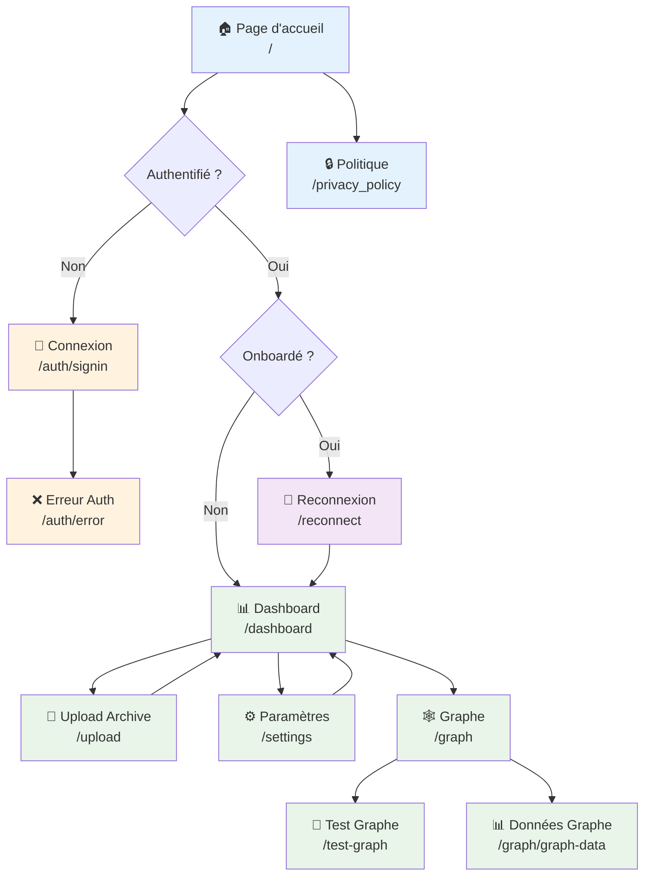

# Structure des Pages - OpenPortability

## Architecture des Pages Next.js

L'application utilise Next.js 15 avec App Router et internationalisation (i18n) pour une structure moderne et multilingue.

```
src/app/
├── [locale]/            # Routes internationalisées
│   ├── auth/           # Pages d'authentification
│   ├── dashboard/      # Tableau de bord principal
│   ├── graph/          # Visualisation du graphe de connexions
│   ├── privacy_policy/ # Politique de confidentialité
│   ├── reconnect/      # Pages de reconnexion/migration
│   ├── settings/       # Paramètres utilisateur
│   ├── test-graph/     # Page de test du graphe
│   ├── upload/         # Upload d'archives Twitter
│   ├── layout.tsx      # Layout avec i18n
│   └── page.tsx        # Page d'accueil
├── _components/        # Composants React réutilisables
├── api/               # API Routes
├── globals.css        # Styles globaux
├── layout.tsx         # Layout racine
└── not-found.tsx      # Page 404
```

## Diagramme de Navigation



## Pages Détaillées

### 1. Pages Publiques

#### Page d'Accueil (`/[locale]/page.tsx`)
**Composants principaux:**
- Hero section avec proposition de valeur OpenPortability
- Fonctionnalités de migration Twitter → Bluesky/Mastodon
- Interface multilingue (français/anglais)
- Call-to-action pour commencer la migration

**Layout:** Utilise le layout internationalisé avec gestion des locales

#### Page Politique de Confidentialité (`/[locale]/privacy_policy/`)
- Politique de confidentialité complète
- Gestion des données personnelles
- Droits RGPD
- Cookies et tracking

### 2. Pages d'Authentification (`/[locale]/auth/`)

#### Connexion (`/[locale]/auth/signin/page.tsx`)
**Composants principaux:**
- Interface de connexion multi-providers
- Support Twitter, Mastodon, Bluesky
- Gestion des erreurs d'authentification
- Redirection post-connexion selon statut onboarding

**Hooks utilisés:**
- NextAuth pour l'authentification
- Redirection conditionnelle selon `has_onboarded`

#### Erreur d'Authentification (`/[locale]/auth/error/page.tsx`)
**Fonctionnalités:**
- Affichage des erreurs d'authentification
- Messages d'erreur localisés
- Boutons de retry et support
- Gestion des erreurs OAuth spécifiques

### 3. Dashboard Principal (`/[locale]/dashboard/`)

#### Dashboard (`/dashboard`)
**Layout:**
```tsx
export default function DashboardLayout({
  children,
}: {
  children: React.ReactNode
}) {
  return (
    <div className="flex h-screen">
      <Sidebar />
      <main className="flex-1 overflow-auto">
        <Header />
        {children}
      </main>
    </div>
  )
}
```

**Composants:**
- `NewsLetterFirstSeen` - Première interaction newsletter
- `MigrateStats` - Statistiques de migration
- `ReconnexionOptions` - Options de reconnexion automatique/manuelle
- Interface conditionnelle selon statut d'onboarding

**Hooks utilisés:**
- `useStats` - Statistiques utilisateur
- `useDashboardState` - État global du dashboard
- `useAuthTokens` - Gestion des tokens d'authentification

### 4. Pages de Reconnexion (`/[locale]/reconnect/`)

#### Reconnexion Principale (`/[locale]/reconnect/page.tsx`)
**Composants principaux:**
- `AutomaticReconnectionState` - Reconnexion automatique
- `ManualReconnectionState` - Sélection manuelle des comptes
- `ReconnectionCompleteState` - État de completion
- Gestion des états de connexion multiples

**Hooks utilisés:**
- `useReconnectState` - État principal de reconnexion
- `useAuthTokens` - Validation des tokens
- `useStats` - Statistiques de migration

### 5. Upload d'Archives (`/[locale]/upload/`)

#### Upload Principal (`/[locale]/upload/page.tsx`)
**Composants principaux:**
- `UploadButton` - Interface d'upload avec drag & drop
- `UploadResults` - Résultats et statut du traitement
- Validation des archives Twitter (.zip, .tar.gz)
- Progression en temps réel

**Fonctionnalités:**
- Support archives Twitter complètes
- Validation côté client et serveur
- Traitement asynchrone avec worker
- Redirection vers dashboard après succès

### 6. Paramètres (`/[locale]/settings/`)

#### Paramètres Principaux (`/[locale]/settings/page.tsx`)
**Composants principaux:**
- `SettingsOptions` - Options de configuration
- `NewsLetterConsentsUpdate` - Gestion des consentements
- `SupportModale` - Support et contact
- Gestion des préférences utilisateur

### 7. Graphe de Connexions (`/[locale]/graph/`)

#### Graphe Principal (`/[locale]/graph/page.tsx`)
**Composants principaux:**
- `SigmaGraphContainer` - Visualisation interactive du graphe
- `GraphControls` - Contrôles de zoom et navigation
- `CommunityFilters` - Filtres par communautés
- Graphe de réseau social avec Sigma.js

**Fonctionnalités:**
- Visualisation des connexions utilisateur
- Filtrage par communautés
- Mode overlay pour réseau personnel
- Navigation interactive

## Composants Partagés (`/src/app/_components/`)

### Composants d'Authentification
- `BlueSkyLogin.tsx` - Interface de connexion Bluesky
- `BlueSkyLoginButton.tsx` - Bouton de connexion Bluesky
- `MastodonLoginButton.tsx` - Bouton de connexion Mastodon
- `TwitterLoginButton.tsx` - Bouton de connexion Twitter
- `DashboardLoginButtons.tsx` - Ensemble des boutons de connexion
- `LoginButtons.tsx` - Boutons de connexion génériques

### Composants de Migration
- `AutomaticReconnexion.tsx` - Reconnexion automatique
- `ManualReconnexion.tsx` - Reconnexion manuelle avec sélection
- `LaunchReconnection.tsx` - Lancement du processus de reconnexion
- `ReconnexionOptions.tsx` - Choix entre auto/manuel
- `AccountToMigrate.tsx` - Comptes à migrer
- `MigrationComplete.tsx` - État de completion

### Composants de Statistiques
- `MigrateStats.tsx` - Statistiques de migration
- `StatsReconnexion.tsx` - Stats spécifiques reconnexion
- `ProfileCard.tsx` - Carte de profil utilisateur
- `ConnectedAccounts.tsx` - Comptes connectés

### Composants d'Interface
- `Header.tsx` - En-tête avec navigation
- `Footer.tsx` - Pied de page
- `LoadingIndicator.tsx` - Indicateur de chargement
- `ProgressSteps.tsx` - Étapes de progression
- `ErrorModal.tsx` - Modal d'erreur
- `SuccessModal.tsx` - Modal de succès
- `ConsentModal.tsx` - Modal de consentement

### Composants Visuels
- `DashboardSea.tsx` - Animation dashboard
- `LoginSea.tsx` - Animation page de connexion
- `MigrateSea.tsx` - Animation page migration
- `Boat.tsx` - Animation bateau

### Composants de Paramètres
- `SettingsOptions.tsx` - Options de paramètres
- `NewsLetterConsentsUpdate.tsx` - Gestion des consentements
- `NewsLetterFirstSeen.tsx` - Première interaction newsletter
- `RequestNewsLetterDM.tsx` - Demande de newsletter DM
- `SupportModale.tsx` - Modal de support

### Composants d'Upload
- `UploadButton.tsx` - Bouton d'upload avec drag & drop
- `UploadResults.tsx` - Résultats d'upload

### Composants Spécialisés
- `PartageButton.tsx` - Bouton de partage
- `RefreshTokenModale.tsx` - Modal de refresh token
- `BlueSkyPreviewModal.tsx` - Prévisualisation Bluesky
- `MatchedBlueSkyProfiles.tsx` - Profils Bluesky correspondants

## Hooks Personnalisés (`/src/hooks/`)

### `useAuthTokens.ts`
```tsx
const {
  tokens,
  isLoading,
  verifyTokens,
  refreshTokens,
  missingProviders
} = useAuthTokens()
```
**Fonctionnalités:**
- Vérification des tokens Bluesky/Mastodon
- Refresh automatique des tokens expirés
- Détection des providers manquants

### `useReconnectState.ts`
```tsx
const {
  matchesData,
  isLoading,
  migrationResults,
  handleStartMigration,
  handleAutomaticReconnection,
  handleManualReconnection
} = useReconnectState()
```
**Fonctionnalités:**
- Gestion complète du processus de reconnexion
- États de migration (automatique/manuelle)
- Résultats de migration en temps réel
- Gestion des erreurs de migration

### `useStats.ts`
```tsx
const {
  stats,
  isLoading,
  error,
  refreshStats
} = useStats()
```
**Fonctionnalités:**
- Statistiques utilisateur avec cache Redis
- Refresh automatique et manuel
- Gestion des erreurs de chargement

### `useDashboardState.ts`
```tsx
const {
  dashboardData,
  isLoading,
  refreshDashboard,
  hasConnectedServices
} = useDashboardState()
```
**Fonctionnalités:**
- État global du dashboard
- Détection des services connectés
- Refresh des données dashboard

### `useNewsLetter.ts`
```tsx
const {
  consents,
  updateConsent,
  isLoading,
  submitConsents
} = useNewsLetter()
```
**Fonctionnalités:**
- Gestion des consentements newsletter
- Update des préférences DM
- Soumission des consentements


### `useMastodonInstances.ts`
```tsx
const {
  instances,
  isLoading,
  searchInstances
} = useMastodonInstances()
```
**Fonctionnalités:**
- Liste des instances Mastodon
- Recherche d'instances
- Cache des instances populaires

## Responsive Design

### Breakpoints
```css
/* Mobile first */
.container {
  @apply px-4;
}

/* Tablet */
@media (min-width: 768px) {
  .container {
    @apply px-6;
  }
}

/* Desktop */
@media (min-width: 1024px) {
  .container {
    @apply px-8;
  }
}
```
