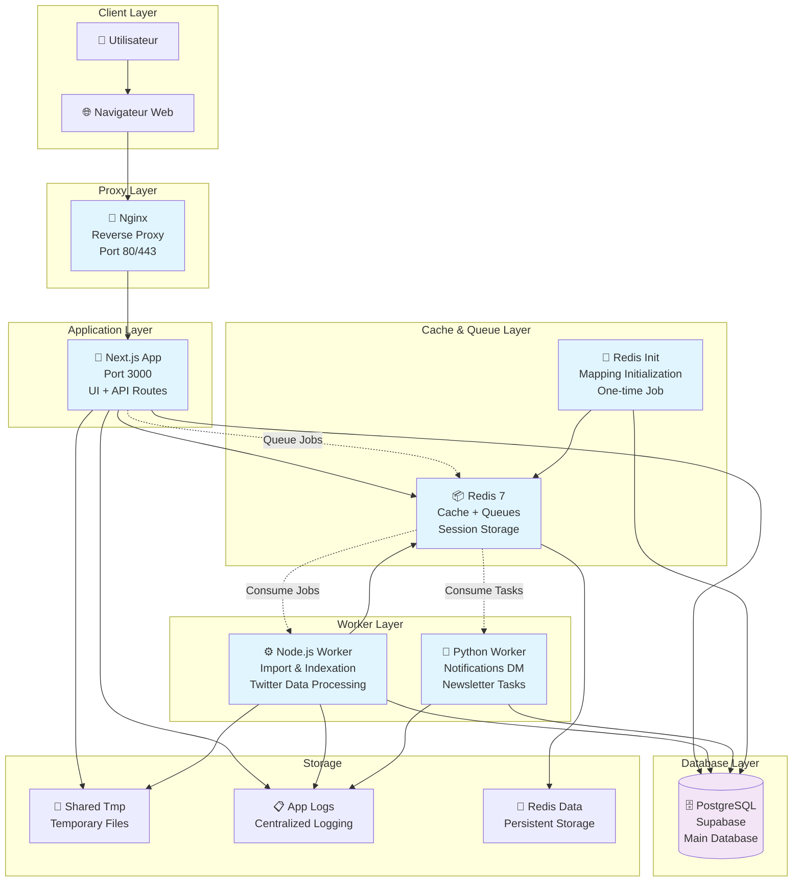

# Architecture des Services - OpenPortability

## Diagramme d'Architecture

## Services Détaillés

### 1. App (Next.js) - Service Principal

**Rôle**: Interface utilisateur et API backend
**Port**: 3000
**Technologie**: Next.js 15, React 19, TypeScript

**Fonctionnalités**:
- Interface utilisateur responsive
- API Routes pour toutes les opérations
- Authentification via NextAuth + Supabase
- Upload et traitement des fichiers Twitter
- Gestion des connexions aux plateformes sociales
- Tableaux de bord et statistiques

**Dépendances**:
- Redis (cache et sessions)
- Supabase (base de données)
- Volumes partagés (tmp, logs)

### 2. Worker (Node.js) - Traitement des Données

**Rôle**: Import et indexation des données Twitter
**Technologie**: Node.js, TypeScript, Bull Queue

**Fonctionnalités**:
- Consommation des jobs depuis Redis
- Parsing des archives Twitter (JSON)
- Extraction des tweets, followers, following
- Indexation dans PostgreSQL
- Calcul des statistiques
- Gestion des erreurs avec retry logic
- Circuit breaker pour la résilience

**Caractéristiques**:
- Traitement asynchrone par lots
- Gestion de la mémoire optimisée
- Monitoring des performances
- Recovery automatique des jobs échoués

### 3. Python Worker - Notifications et Communication

**Rôle**: Envoi de notifications et newsletters
**Technologie**: Python, TypeScript (hybride)

**Fonctionnalités**:
- Envoi de DMs via Bluesky API
- Envoi de DMs via Mastodon API
- Gestion des newsletters
- Templates multilingues
- Retry logic pour les échecs d'envoi

**Spécificités**:
- Support multiplateforme (Bluesky, Mastodon)
- Messages personnalisés par langue
- Planification des tâches
- Gestion des quotas API

### 4. Redis - Cache et Files d'Attente

**Rôle**: Cache, sessions et orchestration des jobs
**Version**: Redis 7 Alpine
**Configuration**: Mot de passe sécurisé, persistence activée

**Utilisation**:
- **Cache**: Données utilisateur fréquentes
- **Sessions**: Stockage des sessions NextAuth
- **Queues**: Jobs d'import et de notification
- **Locks**: Prévention des doublons de traitement
- **Metrics**: Compteurs de performance

**Sécurité**:
- Authentification par mot de passe
- Pas d'exposition de port en production
- Health checks réguliers

### 5. Redis Init - Initialisation

**Rôle**: Configuration initiale des mappings Redis
**Type**: Job unique au démarrage

**Fonctionnalités**:
- Création des structures de données Redis
- Mapping des IDs utilisateurs
- Initialisation des compteurs
- Vérification de la connectivité

### 6. Nginx - Reverse Proxy

**Rôle**: Point d'entrée et load balancing
**Ports**: 80 (HTTP), 443 (HTTPS)

**Fonctionnalités**:
- Reverse proxy vers l'app Next.js
- Terminaison SSL/TLS
- Compression gzip
- Limitation de débit
- Logs d'accès centralisés

## Réseaux Docker

### app_network
- Réseau interne pour la communication inter-services
- Bridge driver pour l'isolation

### supabase_network_goodbyex
- Réseau externe pour la connexion à Supabase
- Partagé avec d'autres services si nécessaire

## Volumes et Stockage

### shared-tmp
- **Type**: tmpfs (en mémoire)
- **Usage**: Fichiers temporaires de traitement
- **Sécurité**: noexec pour prévenir l'exécution

### app_logs
- **Type**: Bind mount
- **Path**: `/home/ubuntu/openportability_logs`
- **Usage**: Logs centralisés de tous les services

### redis_data
- **Type**: Volume Docker
- **Usage**: Persistence des données Redis
- **Backup**: Recommandé pour la production

## Scalabilité

### Horizontal Scaling
- **Workers**: Plusieurs instances possibles
- **App**: Load balancing via Nginx
- **Redis**: Cluster mode pour haute disponibilité

### Vertical Scaling
- **Memory**: Ajustable via Docker limits
- **CPU**: Multi-threading natif Node.js/Python
- **Storage**: Volumes extensibles

## Monitoring et Observabilité

### Health Checks
- Redis: `redis-cli ping`
- App: HTTP endpoint `/api/health`
- Workers: Process monitoring

### Métriques
- Throughput des jobs
- Latence des requêtes
- Utilisation mémoire/CPU
- Taille des queues Redis

### Logs
- Format JSON structuré
- Niveaux: ERROR, WARN, INFO, DEBUG
- Rotation automatique
- Centralisation dans `/app/logs`
