# Auth Refresh Endpoint - Services & Repositories Structure

## Overview

This diagram shows the services and repositories architecture for the token refresh endpoint (`/api/auth/refresh`), including all dependencies and data flow for OAuth token verification and refresh operations.

## Architecture Diagram

```mermaid
graph TB
    %% Client Layer
    Client[Client Application]
    
    %% API Layer
    subgraph "API Layer"
        RefreshRoute["/api/auth/refresh<br/>route.ts"]
        Middleware{{"Validation Middleware<br/>(withValidation)"}}
        EmptySchema["EmptySchema<br/>(Zod Validation)"]
    end
    
    %% Service Layer
    subgraph "Service Layer"
        AccountService["AccountService<br/>accountService.ts"]
        LoggingService["Logger<br/>(log_utils.ts)"]
    end
    
    %% Repository Layer
    subgraph "Repository Layer"
        AccountRepo["AccountRepository<br/>accountRepository.ts"]
        SupabaseAdapter["Supabase Adapter<br/>supabase-adapter.ts"]
    end
    
    %% External APIs
    subgraph "External APIs"
        BlueskyAPI["Bluesky AT Protocol<br/>@atproto/api<br/>BskyAgent"]
        MastodonAPI["Mastodon Instance APIs<br/>Token Verification"]
    end
    
    %% Database Layer
    subgraph "Database Layer (Supabase)"
        UsersTable[("next-auth.users<br/>User Profiles")]
        AccountsTable[("next-auth.accounts<br/>OAuth Tokens")]
    end
    
    %% Authentication System
    subgraph "Authentication System"
        NextAuth["NextAuth.js<br/>Session Management"]
        SessionValidation["Session Validation<br/>auth()"]
    end
    
    %% Security Layer
    subgraph "Security"
        Encryption["Token Encryption<br/>encryption.ts"]
        Decryption["Token Decryption<br/>decrypt()"]
    end
    
    %% Main Flow
    Client -->|POST request| RefreshRoute
    RefreshRoute --> Middleware
    Middleware --> EmptySchema
    Middleware --> SessionValidation
    SessionValidation -->|Validate Session| NextAuth
    NextAuth -->|Session Data| Middleware
    Middleware -->|Authenticated Request| RefreshRoute
    
    RefreshRoute --> AccountService
    
    %% Bluesky Token Flow
    AccountService -->|verifyAndRefreshBlueskyToken| AccountRepo
    AccountRepo -->|getProviderAccount| AccountsTable
    AccountsTable -->|Encrypted Tokens| AccountRepo
    AccountRepo -->|Decrypt Tokens| Decryption
    Decryption -->|Plain Tokens| AccountService
    
    AccountService -->|resumeSession| BlueskyAPI
    BlueskyAPI -->|Token Status/New Tokens| AccountService
    AccountService -->|updateTokens| AccountRepo
    AccountRepo -->|Encrypt New Tokens| Encryption
    Encryption -->|Store Encrypted| AccountsTable
    
    %% Mastodon Token Flow
    AccountService -->|verifyAndRefreshMastodonToken| AccountRepo
    AccountRepo -->|getProviderAccount| AccountsTable
    AccountService -->|Verify Token| MastodonAPI
    MastodonAPI -->|Token Status| AccountService
    
    %% Response Flow
    AccountService -->|Results| RefreshRoute
    RefreshRoute -->|Success/Error Response| Client
    
    %% Logging
    RefreshRoute --> LoggingService
    AccountService --> LoggingService
    AccountRepo --> LoggingService
    
    %% User Profile Check
    RefreshRoute -->|Check Connected Accounts| UsersTable
    UsersTable -->|bluesky_username, mastodon_username| RefreshRoute
    
    %% Styling
    classDef apiLayer fill:#e1f5fe
    classDef serviceLayer fill:#f3e5f5
    classDef repoLayer fill:#e8f5e8
    classDef externalAPI fill:#fff3e0
    classDef database fill:#fce4ec
    classDef auth fill:#f1f8e9
    classDef security fill:#ffebee
    
    class RefreshRoute,Middleware,EmptySchema apiLayer
    class AccountService,LoggingService serviceLayer
    class AccountRepo,SupabaseAdapter repoLayer
    class BlueskyAPI,MastodonAPI externalAPI
    class UsersTable,AccountsTable database
    class NextAuth,SessionValidation auth
    class Encryption,Decryption security
```

## Component Details

### API Layer
- **RefreshRoute**: Main POST endpoint handler
- **Validation Middleware**: `withValidation` with authentication required
- **EmptySchema**: Zod schema for empty request body validation

### Service Layer
- **AccountService**: Business logic for token verification and refresh
  - `verifyAndRefreshBlueskyToken(userId)`: Bluesky token management
  - `verifyAndRefreshMastodonToken(userId)`: Mastodon token management
- **LoggingService**: Centralized logging for operations and errors

### Repository Layer
- **AccountRepository**: Data access layer for account operations
  - `getProviderAccount(userId, provider)`: Retrieve OAuth account data
  - `updateTokens(userId, provider, tokens)`: Update refreshed tokens
- **SupabaseAdapter**: NextAuth.js integration with Supabase

### External APIs
- **Bluesky AT Protocol**: Token verification via `BskyAgent.resumeSession()`
- **Mastodon APIs**: Instance-specific token validation endpoints

### Database Layer
- **next-auth.users**: User profiles with social media account flags
- **next-auth.accounts**: Encrypted OAuth tokens and account data

### Security Layer
- **Encryption**: Encrypts tokens before database storage
- **Decryption**: Decrypts tokens for API operations

## Data Flow

### Token Refresh Process

1. **Request Validation**: Client sends POST → Middleware validates empty body
2. **Session Check**: Validates user authentication via NextAuth.js
3. **Account Detection**: Checks user profile for connected social accounts
4. **Token Retrieval**: Repository fetches encrypted tokens from database
5. **Token Decryption**: Decrypts tokens for API operations
6. **Provider Verification**: Calls external APIs to verify/refresh tokens
7. **Token Update**: Encrypts and stores any new tokens
8. **Response**: Returns verification results for each provider

### Security Flow

- **Encryption at Rest**: All tokens encrypted in database
- **Decryption for Use**: Tokens decrypted only when needed for API calls
- **Re-encryption**: New tokens immediately encrypted before storage
- **Session Validation**: All operations require valid user session

## Key Integrations

### NextAuth.js Integration
- Uses existing session management system
- Validates user authentication before token operations
- Integrates with account linking system

### Provider-Specific Handling
- **Bluesky**: Uses official AT Protocol client for token management
- **Mastodon**: Direct API calls to instance-specific endpoints
- **Isolated Operations**: Each provider handled independently

### Error Handling
- **Provider Failures**: Isolated per provider (one can fail without affecting others)
- **Network Issues**: Graceful degradation with proper error responses
- **Token Expiry**: Clear indication when re-authentication is required

This architecture provides secure, efficient token management while maintaining separation of concerns and proper error handling for OAuth token lifecycle management.
