# Bluesky Authentication Endpoint - Architecture Diagram

## Overview

This diagram shows the complete architecture and data flow for the Bluesky authentication endpoint (`/api/auth/bluesky`), including all services, repositories, external APIs, and database interactions.

## Architecture Diagram

```mermaid
graph TB
    %% Client Layer
    Client[Client Application]
    
    %% API Layer
    subgraph "API Layer"
        BlueskyRoute["/api/auth/bluesky<br/>route.ts"]
        Middleware{{"Validation Middleware<br/>(withPublicValidation)"}}
        AuthSchema["AuthCredentialsSchema<br/>(Zod Validation)"]
    end
    
    %% Service Layer
    subgraph "Service Layer"
        BlueskyService["BlueskyService<br/>blueskyServices.ts"]
        ValidationService["Security Utils<br/>(SQL/XSS Detection)"]
        LoggingService["Logger<br/>(log_utils.ts)"]
    end
    
    %% Repository Layer
    subgraph "Repository Layer"
        BlueskyRepo["BlueskyRepository<br/>blueskyRepository.ts"]
        SupabaseAdapter["Supabase Adapter<br/>supabase-adapter.ts"]
    end
    
    %% External APIs
    subgraph "External APIs"
        BlueskyAPI["Bluesky AT Protocol<br/>@atproto/api<br/>BskyAgent"]
        BlueskyService2["bsky.social<br/>API Service"]
    end
    
    %% Database Layer
    subgraph "Database Layer (Supabase)"
        UsersTable[("next-auth.users<br/>User Profiles")]
        AccountsTable[("next-auth.accounts<br/>OAuth Accounts")]
        SessionsTable[("next-auth.sessions<br/>User Sessions")]
        SourcesTargets[("sources_targets<br/>Follow Status")]
    end
    
    %% Authentication System
    subgraph "Authentication System"
        NextAuth["NextAuth.js<br/>Session Management"]
        AuthConfig["auth.config.ts<br/>Configuration"]
        CSRFToken["CSRF Token<br/>Validation"]
    end
    
    %% Encryption
    subgraph "Security"
        Encryption["Token Encryption<br/>encryption.ts"]
        Cookies["Session Cookies<br/>HTTP-Only"]
    end
    
    %% Flow for POST /api/auth/bluesky
    Client -->|POST credentials| BlueskyRoute
    BlueskyRoute --> Middleware
    Middleware --> AuthSchema
    Middleware --> ValidationService
    ValidationService -->|Security Check| Middleware
    Middleware -->|Validated Data| BlueskyRoute
    
    BlueskyRoute --> BlueskyService
    BlueskyService --> BlueskyAPI
    BlueskyAPI --> BlueskyService2
    BlueskyService2 -->|Auth Result| BlueskyAPI
    BlueskyAPI -->|Session Data| BlueskyService
    
    BlueskyService -->|Get Profile| BlueskyAPI
    BlueskyAPI -->|Profile Data| BlueskyService
    BlueskyService -->|Auth + Profile| BlueskyRoute
    
    BlueskyRoute --> BlueskyRepo
    BlueskyRepo -->|getUserByBlueskyId| SupabaseAdapter
    SupabaseAdapter -->|Query by DID| AccountsTable
    AccountsTable -->|User Data| SupabaseAdapter
    SupabaseAdapter -->|User or null| BlueskyRepo
    BlueskyRepo -->|User Status| BlueskyRoute
    
    %% User Creation/Update Flow
    BlueskyRoute -->|Create User| SupabaseAdapter
    SupabaseAdapter -->|Insert User| UsersTable
    
    BlueskyRoute -->|Link Account| BlueskyRepo
    BlueskyRepo -->|linkBlueskyAccount| SupabaseAdapter
    SupabaseAdapter -->|Encrypt Tokens| Encryption
    Encryption -->|Encrypted Data| SupabaseAdapter
    SupabaseAdapter -->|Insert Account| AccountsTable
    
    BlueskyRepo -->|updateBlueskyProfile| SupabaseAdapter
    SupabaseAdapter -->|Update Profile| UsersTable
    
    BlueskyRepo -->|updateFollowStatus| SourcesTargets
    
    %% Session Management
    BlueskyRoute --> NextAuth
    NextAuth --> AuthConfig
    NextAuth --> SessionsTable
    NextAuth --> Cookies
    
    %% Logging
    BlueskyRoute --> LoggingService
    BlueskyService --> LoggingService
    BlueskyRepo --> LoggingService
    
    %% DELETE Flow
    Client -->|DELETE + CSRF| BlueskyRoute
    BlueskyRoute --> CSRFToken
    CSRFToken -->|Validate| BlueskyRoute
    BlueskyRoute -->|Delete Session| SupabaseAdapter
    SupabaseAdapter -->|Remove Session| SessionsTable
    BlueskyRoute -->|Clear Cookies| Cookies
    
    %% Response Flow
    BlueskyRoute -->|Response| Client
    
    %% Styling
    classDef apiLayer fill:#e1f5fe
    classDef serviceLayer fill:#f3e5f5
    classDef repoLayer fill:#e8f5e8
    classDef externalAPI fill:#fff3e0
    classDef database fill:#fce4ec
    classDef auth fill:#f1f8e9
    classDef security fill:#ffebee
    
    class BlueskyRoute,Middleware,AuthSchema apiLayer
    class BlueskyService,ValidationService,LoggingService serviceLayer
    class BlueskyRepo,SupabaseAdapter repoLayer
    class BlueskyAPI,BlueskyService2 externalAPI
    class UsersTable,AccountsTable,SessionsTable,SourcesTargets database
    class NextAuth,AuthConfig,CSRFToken auth
    class Encryption,Cookies security
```

## Component Descriptions

### API Layer
- **BlueskyRoute**: Main endpoint handler for POST and DELETE requests
- **Validation Middleware**: `withPublicValidation` and `withValidation` wrappers
- **AuthCredentialsSchema**: Zod schema for request validation

### Service Layer
- **BlueskyService**: Business logic for Bluesky operations (login, profile, session management)
- **ValidationService**: Security utilities for SQL injection and XSS detection
- **LoggingService**: Centralized logging with different levels (info, warning, error)

### Repository Layer
- **BlueskyRepository**: Data access layer for Bluesky-specific database operations
- **SupabaseAdapter**: Custom adapter for NextAuth.js integration with Supabase

### External APIs
- **@atproto/api (BskyAgent)**: Official Bluesky AT Protocol client library
- **bsky.social**: Bluesky's main API service endpoint

### Database Layer
- **next-auth.users**: User profiles and social media account information
- **next-auth.accounts**: OAuth account linking with encrypted tokens
- **next-auth.sessions**: Active user sessions for authentication
- **sources_targets**: Follow status tracking for migration features

### Authentication System
- **NextAuth.js**: Session management and authentication framework
- **auth.config.ts**: Authentication configuration and provider setup
- **CSRF Token**: Cross-site request forgery protection

### Security Components
- **Token Encryption**: Encrypts sensitive tokens before database storage
- **Session Cookies**: HTTP-only cookies for secure session management

## Data Flow

### POST Authentication Flow
1. **Request Validation**: Client sends credentials → Middleware validates with Zod schema
2. **Security Checks**: Middleware scans for SQL injection and XSS attacks
3. **Bluesky Authentication**: Service calls Bluesky API with credentials
4. **Profile Retrieval**: Service fetches user profile from Bluesky
5. **User Resolution**: Repository checks if user exists by Bluesky DID
6. **Account Management**: Creates new user or links account to existing user
7. **Token Storage**: Encrypts and stores Bluesky tokens in database
8. **Session Creation**: NextAuth.js creates authenticated session
9. **Response**: Returns user data with Bluesky information

### DELETE Logout Flow
1. **CSRF Validation**: Validates CSRF token from request headers
2. **Session Deletion**: Removes session from database via adapter
3. **Cookie Clearing**: Expires all NextAuth session cookies
4. **Response**: Returns success confirmation

## Key Integrations

### NextAuth.js Integration
- Uses same session management system as other OAuth providers
- Shares user database schema and authentication flow
- Integrates with existing cookie and CSRF protection

### Migration System Integration
- Stores encrypted Bluesky tokens for later API operations
- Updates follow status in `sources_targets` table
- Supports batch following operations for user migration

### Security Integration
- Implements multi-layer validation (Zod + Security Utils)
- Uses encrypted token storage for sensitive data
- Follows secure session management practices

## Error Handling Points

### External API Failures
- Bluesky API authentication failures
- Network connectivity issues
- Rate limiting from Bluesky service

### Database Failures
- Supabase connection issues
- Constraint violations (duplicate accounts)
- Transaction failures during user creation

### Security Failures
- Invalid CSRF tokens
- SQL injection or XSS attempts
- Session validation failures

This architecture provides a robust, secure, and scalable solution for Bluesky authentication while maintaining integration with the existing OpenPortability authentication system.
