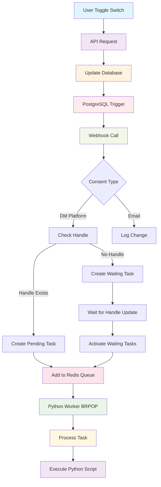

# Consent and Newsletter Request Architecture

## Overview

The consent and newsletter request system in OpenPortability manages user preferences for various communication channels and triggers automated tasks based on consent changes. This system combines PostgreSQL triggers, webhook notifications, Redis queues, and Python task processing to provide a robust, event-driven architecture.

## System Components

### 1. Data Model (`newsletter_consents` table)

```sql
Table "public.newsletter_consents"
      Column       |           Type           | Nullable |      Default      
-------------------+--------------------------+----------+-------------------
 id                | uuid                     | not null | gen_random_uuid() 
 user_id           | uuid                     | not null |                   
 consent_type      | character varying(50)    | not null |                   
 consent_value     | boolean                  | not null | false             
 consent_timestamp | timestamp with time zone |          | CURRENT_TIMESTAMP 
 is_active         | boolean                  | not null | true              
 user_agent        | text                     |          |                   
 ip_address        | inet                     |          |                   
 created_at        | timestamp with time zone |          | CURRENT_TIMESTAMP 
 updated_at        | timestamp with time zone |          | CURRENT_TIMESTAMP 
 ip_address_full   | text                     |          |                   
```

#### Key Features:
- **Unique Active Constraint**: Only one active consent per user per consent type
- **Audit Trail**: Tracks user agent, IP address, and timestamps
- **Soft Deletion**: Uses `is_active` flag instead of hard deletes
- **Foreign Key**: Links to `"next-auth".users(id)` with CASCADE delete

#### Consent Types:
- `bluesky_dm`: Direct messages via Bluesky
- `mastodon_dm`: Direct messages via Mastodon  
- `email_newsletter`: Email newsletter subscription
- `oep_newsletter`: OpenPortability newsletter
- `research_participation`: Research participation consent

### 2. Database Triggers

#### `deactivate_previous_consents_trigger`
- **Type**: BEFORE INSERT OR UPDATE
- **Purpose**: Ensures only one active consent per user/type
- **Function**: `deactivate_previous_consents()`

#### `newsletter_consent_change_trigger`
- **Type**: AFTER INSERT OR UPDATE
- **Purpose**: Triggers webhook notifications for consent changes
- **Function**: `notify_consent_change()`

### 3. Trigger Function: `notify_consent_change()`

This function handles the core business logic for consent change notifications:

#### Key Features:
- **Change Detection**: Ignores updates that only change `is_active`
- **User Data Retrieval**: Fetches social platform handles from `"next-auth".users`
- **Handle Construction**: 
  - Bluesky: Uses `bluesky_username`
  - Mastodon: Combines `mastodon_username@mastodon_instance`
- **Webhook Call**: Sends HTTP POST to `/api/internal/process-consent-change`
- **Error Handling**: Uses WARNING instead of ERROR to prevent transaction rollback

#### Webhook Payload:
```json
{
  "user_id": "uuid",
  "consent_type": "bluesky_dm|mastodon_dm|email_newsletter|...",
  "consent_value": true|false,
  "old_consent_value": true|false|null,
  "handle": "username|username@instance|null",
  "metadata": {
    "userAgent": "string",
    "ip": "string",
    "trigger_operation": "INSERT|UPDATE",
    "timestamp": "ISO_timestamp"
  }
}
```

## Frontend Components

### 1. User Interface: `SwitchSettingsSection.tsx`

The consent management starts with the user interface component that handles consent toggles:

#### Key Features:
- **Switch Controls**: Toggle switches for each consent type (Bluesky DM, Mastodon DM, Email)
- **Account Validation**: Checks if user has connected social accounts before enabling DM consent
- **Toast Notifications**: Provides feedback and warnings when toggling consent
- **Conditional Logic**: Different handling for enabling vs disabling consent

#### Consent Toggle Flow:
```typescript
const handleDMConsentChange = (platform: 'bluesky' | 'mastodon', value: boolean) => {
  // Check if user has connected account for the platform
  const hasAccount = platform === 'bluesky' 
    ? !!session?.user?.bluesky_username
    : !!session?.user?.mastodon_username;
    
  // Show warning toast and proceed with consent change
  onConsentChange(`${platform}_dm` as ConsentType, value);
};
```

#### User Experience:
- **Account Required Toast**: Shows when user tries to enable DM without connected account
- **Warning Toast**: Informs user about DM testing when enabling consent
- **Immediate Feedback**: Visual confirmation of consent changes

## API Architecture

### 1. Public API: `/api/newsletter/request`

#### GET Endpoint
- **Purpose**: Retrieve user's active consents and email
- **Authentication**: Required
- **Response**: 
```json
{
  "email": "user@example.com",
  "bluesky_dm": true,
  "mastodon_dm": false,
  "email_newsletter": true
}
```

#### POST Endpoint  
- **Purpose**: Update user consent preferences
- **Authentication**: Required
- **Validation**: Uses `NewsletterRequestSchema` with security checks
- **Request Body**:
```json
{
  "consents": [
    {
      "type": "bluesky_dm",
      "value": true
    }
  ],
  "email": "optional@email.com"
}
```

### 2. Internal API: `/api/internal/process-consent-change`

This webhook endpoint processes consent changes triggered by the PostgreSQL function:

#### Key Responsibilities:
1. **Validation**: Validates webhook payload using `ConsentChangeSchema`
2. **Routing**: Routes to appropriate handlers based on consent type
3. **Task Creation**: Creates Python tasks for DM platforms
4. **Redis Integration**: Adds tasks to Redis queues with deduplication

#### Handler Functions:

##### `handlePlatformDMConsent()`
- **Purpose**: Manages DM consent for Bluesky/Mastodon
- **Logic**:
  - If consent enabled + handle exists → Create immediate test-dm task
  - If consent enabled + no handle → Create waiting test-dm task  
  - If consent disabled → Delete pending tasks

##### `handleEmailNewsletterConsent()`
- **Purpose**: Manages email newsletter consent
- **Logic**: Currently logs the change (extensible for future email logic)

### 3. Internal API: `/api/internal/activate-waiting-tasks`

This endpoint handles the activation of waiting tasks when users connect their social accounts:

#### Key Features:
- **HMAC Security**: Protected by internal validation middleware
- **Task Activation**: Converts waiting tasks to pending status
- **Redis Integration**: Adds newly activated tasks to Redis queues
- **Deduplication**: Prevents duplicate task creation

#### Workflow:
1. **Triggered by**: PostgreSQL triggers when social handles are added/updated
2. **Retrieves**: Recently activated pending tasks (last 5 minutes)
3. **Processes**: Each task with handle and metadata
4. **Adds to Redis**: Uses daily queue pattern `consent_tasks:YYYY-MM-DD`
5. **Deduplication**: Sets temporary keys to prevent duplicates

#### Payload Structure:
```json
{
  "user_id": "uuid",
  "platform": "bluesky|mastodon",
  "handle": "username|username@instance",
  "activated_tasks": 1,
  "metadata": {
    "trigger_operation": "UPDATE",
    "timestamp": "ISO_timestamp",
    "source": "social_account_connection"
  }
}
```

## Task Processing Architecture

### 1. Python Tasks Table (`python_tasks`)

The system uses a `python_tasks` table to queue background tasks:

#### Task Types:
- **`test-dm`**: Initial DM test when consent is first enabled
- **`send-reco-newsletter`**: Periodic recommendation newsletters

#### Task Statuses:
- **`waiting`**: Task created but missing required data (e.g., social handle)
- **`pending`**: Task ready for processing
- **`completed`**: Task successfully processed
- **`failed`**: Task failed after retries

### 2. Redis Queue Integration

#### Queue Structure:
- **Key Pattern**: `consent_tasks:YYYY-MM-DD`
- **Data Format**: JSON task objects with metadata
- **Deduplication**: Uses `task_dedup:userId:platform:task_type` keys

#### Benefits:
- **Performance**: Faster than database polling
- **Scalability**: Supports multiple worker processes
- **Reliability**: Fallback to database when Redis unavailable

## Python Worker Architecture

### 1. Worker Process: `python_worker/src/index.ts`

The Python worker is responsible for consuming and processing consent-related tasks:

#### Key Features:
- **Redis-First Consumption**: Uses `BRPOP` to consume from Redis queues
- **PostgreSQL Fallback**: Falls back to database polling when Redis unavailable
- **Retry Logic**: 3 attempts with exponential backoff for failed tasks
- **Multi-Language Support**: Loads message templates for different languages
- **Graceful Shutdown**: Handles SIGTERM signals for clean shutdown

#### Task Consumption Flow:
```typescript
async function consumeTask(workerId: string): Promise<PythonTask | null> {
  try {
    // 1. Try Redis first (BRPOP with 2-second timeout)
    const result = await redis.brpop(`consent_tasks:${today}`, 2);
    if (result) {
      return JSON.parse(result[1]);
    }
    
    // 2. Fallback to PostgreSQL
    return await claimNextPendingTask();
  } catch (error) {
    console.error('Error consuming task:', error);
    return null;
  }
}
```

#### Worker Configuration:
- **Worker ID**: Configurable via `WORKER_ID` environment variable
- **Max Retries**: 3 attempts before marking task as failed
- **Polling Interval**: 2-minute sleep between consumption attempts
- **Message Loading**: Loads all language templates at startup

### 2. Task Processing: `PythonProcessor.ts`

Handles the actual execution of Python scripts for different task types:

#### Task Types Supported:
- **`test-dm`**: Initial DM test when consent is first enabled
- **`send-reco-newsletter`**: Periodic recommendation newsletters with user stats

#### Processing Flow:
1. **Task Validation**: Validates task structure and required fields
2. **Language Detection**: Determines user's preferred language
3. **Message Preparation**: Loads appropriate message templates
4. **Python Execution**: Executes platform-specific Python scripts
5. **Status Updates**: Updates task status in database
6. **Error Handling**: Manages retries and failure scenarios

#### Python Script Integration:
- **Bluesky**: `testDm_bluesky.py` for Bluesky direct messages
- **Mastodon**: `testDm_mastodon.py` for Mastodon direct messages
- **Newsletter Logic**: Integrated stats retrieval and message personalization

### 3. Task Lifecycle



#### Component Mapping:
- **A (User Toggle Switch)**: `SwitchSettingsSection.tsx`
- **B (API Request)**: `/api/newsletter/request`
- **C (Update Database)**: `newsletter_consents` table
- **D (PostgreSQL Trigger)**: `notify_consent_change()` function
- **E (Webhook Call)**: `/api/internal/process-consent-change`
- **H/I (Create Tasks)**: `python_tasks` table
- **J (Add to Redis Queue)**: `consent_tasks:YYYY-MM-DD`
- **K (Wait for Handle Update)**: Social Account Connection
- **L (Activate Waiting Tasks)**: `/api/internal/activate-waiting-tasks`
- **M (Python Worker BRPOP)**: Redis consumption
- **N (Process Task)**: `PythonProcessor.ts`
- **O (Execute Python Script)**: `testDm_platform.py`
- **P (Log Change)**: Future Email Processing

## Security Features

### 1. Input Validation
- **Zod Schemas**: Strict validation for all API inputs
- **SQL Injection Protection**: Parameterized queries and escaping
- **XSS Prevention**: HTML escaping for user content

### 2. Authentication & Authorization
- **Session-based Auth**: All endpoints require valid session
- **Internal API Security**: HMAC signature validation for webhooks
- **Rate Limiting**: Configurable per endpoint

### 3. Audit Trail
- **Comprehensive Logging**: All consent changes logged with metadata
- **IP Tracking**: Both inet and full text IP addresses stored
- **User Agent Tracking**: Browser/client information preserved

## Error Handling & Reliability

### 1. Database Level
- **Trigger Exceptions**: Use WARNING instead of ERROR to prevent rollback
- **Constraint Violations**: Handled gracefully with appropriate responses
- **Transaction Safety**: Ensures data consistency across operations

### 2. API Level
- **Graceful Degradation**: Redis failures don't break core functionality
- **Retry Logic**: Failed webhook calls logged but don't block user operations
- **Validation Errors**: Clear error messages for invalid inputs

### 3. Task Processing
- **Deduplication**: Prevents duplicate task creation
- **Fallback Mechanisms**: Database polling when Redis unavailable
- **Status Tracking**: Clear task lifecycle with failure recovery

## Configuration

### Environment Variables
```env
# Redis Configuration
REDIS_HOST=localhost
REDIS_PORT=6379
REDIS_PASSWORD=your_password

# Internal API Security
INTERNAL_API_KEY=your_api_key
WEBHOOK_SECRET=your_webhook_secret

# Database
DATABASE_URL=postgresql://...
```

### Rate Limiting
- **Newsletter API**: Standard rate limiting (5 req/min)
- **Internal Webhooks**: Higher limits for system-to-system calls
- **Configurable**: Per-endpoint customization available

## Monitoring & Observability

### 1. Logging
- **Structured Logging**: Consistent format across all components
- **Context Preservation**: User ID, session info in all logs
- **Error Tracking**: Detailed error messages with stack traces

### 2. Metrics
- **Consent Changes**: Track consent type and value changes
- **Task Processing**: Monitor task creation, completion, and failures
- **API Performance**: Response times and error rates

### 3. Health Checks
- **Database Connectivity**: Monitor PostgreSQL connection
- **Redis Availability**: Track Redis connection status
- **Webhook Delivery**: Monitor internal API call success rates

## Future Enhancements

### 1. Planned Features
- **Email Newsletter Integration**: Full email sending capability
- **Advanced Scheduling**: More sophisticated task scheduling
- **Consent Analytics**: Dashboard for consent trends

### 2. Scalability Improvements
- **Horizontal Scaling**: Support for multiple worker instances
- **Queue Partitioning**: Distribute load across multiple Redis instances
- **Caching Layer**: Cache frequent consent lookups

### 3. Compliance Features
- **GDPR Compliance**: Enhanced data retention and deletion
- **Audit Reporting**: Automated compliance reports
- **Consent History**: Detailed change tracking for legal requirements

This architecture provides a robust, scalable foundation for managing user consent and automating communication workflows while maintaining security, reliability, and compliance standards.
