# Migrate Matching System Architecture

## Overview

This document provides a comprehensive architectural view of the matching system used by the migrate endpoints, showing the relationships between types, repositories, and services that enable cross-platform account discovery and follow operations.

## Architecture Diagram

```mermaid
graph TB
    %% API Layer
    subgraph "API Endpoints"
        API1["/api/migrate/matching_found<br/>GET - Retrieve Matches"]
        API2["/api/migrate/send_follow<br/>POST - Execute Follows"]
        API3["/api/migrate/ignore<br/>POST - Ignore Accounts"]
    end

    %% Service Layer
    subgraph "Service Layer"
        MS["MatchingService<br/>Core Operations"]
        SS["StatsService<br/>Statistics Management"]
        BS["BlueskyService<br/>Batch Follow Operations"]
        MAS["MastodonService<br/>Batch Follow Operations"]
    end

    %% Repository Layer
    subgraph "Repository Layer"
        MR["MatchingRepository<br/>Data Access + Redis Cache"]
        SR["StatsRepository<br/>Statistics Queries"]
    end

    %% Type System
    subgraph "Type Definitions"
        subgraph "Core Types"
            MT["MatchingTarget<br/>node_id + platform data"]
            MF["MatchedFollower<br/>source_twitter_id + mappings"]
            SPT["StoredProcedureTarget<br/>Database format"]
        end
        
        subgraph "Result Types"
            MR_TYPE["MatchingResult<br/>following + stats"]
            MSTATS["MatchingStats<br/>platform metrics"]
        end
        
        subgraph "Action Types"
            FA["FollowAction<br/>operation tracking"]
        end
    end

    %% Data Layer
    subgraph "Data Layer"
        subgraph "PostgreSQL Database"
            ST["sources_targets<br/>Follow targets + status"]
            SF["sources_followers<br/>Follower relationships"]
            UI["users<br/>User profiles + connections"]
        end
        
        subgraph "Redis Cache"
            RC1["twitter_to_bluesky<br/>Platform mappings"]
            RC2["twitter_to_mastodon<br/>Platform mappings"]
            RC3["followable_targets<br/>Cached results"]
        end
    end

    %% External APIs
    subgraph "External APIs"
        BSKY["Bluesky AT Protocol<br/>Follow operations"]
        MASTO["Mastodon APIs<br/>Multi-instance support"]
    end

    %% Connections
    API1 --> MS
    API2 --> MS
    API3 --> MS
    
    MS --> MR
    MS --> SS
    MS --> BS
    MS --> MAS
    
    MR --> ST
    MR --> SF
    MR --> UI
    MR --> RC1
    MR --> RC2
    MR --> RC3
    
    SS --> SR
    SR --> ST
    SR --> SF
    
    BS --> BSKY
    MAS --> MASTO
    
    %% Type Usage
    MS -.-> MT
    MS -.-> MF
    MS -.-> MR_TYPE
    MS -.-> MSTATS
    MS -.-> FA
    
    MR -.-> SPT
    MR -.-> MT
    MR -.-> MF

    %% Styling
    classDef apiClass fill:#e1f5fe,stroke:#01579b,stroke-width:2px
    classDef serviceClass fill:#f3e5f5,stroke:#4a148c,stroke-width:2px
    classDef repoClass fill:#e8f5e8,stroke:#1b5e20,stroke-width:2px
    classDef typeClass fill:#fff3e0,stroke:#e65100,stroke-width:2px
    classDef dataClass fill:#fce4ec,stroke:#880e4f,stroke-width:2px
    classDef externalClass fill:#f1f8e9,stroke:#33691e,stroke-width:2px

    class API1,API2,API3 apiClass
    class MS,SS,BS,MAS serviceClass
    class MR,SR repoClass
    class MT,MF,SPT,MR_TYPE,MSTATS,FA typeClass
    class ST,SF,UI,RC1,RC2,RC3 dataClass
    class BSKY,MASTO externalClass
```



## Component Details

### Type System

#### Core Entity Types
- **`MatchingTarget`**: Represents accounts that can be followed (onboarded users)
  - Contains `node_id` for database references
  - Tracks follow status per platform (`has_follow_bluesky`, `has_follow_mastodon`)
  - Includes cross-platform account data (Bluesky handles, Mastodon instances)

- **`MatchedFollower`**: Represents discovered accounts from Twitter followers (new users)
  - Contains `source_twitter_id` for relationship tracking
  - Tracks follow history (`has_been_followed_on_*`)
  - Enriched with Redis mapping data

- **`StoredProcedureTarget`**: Database-optimized format
  - Uses `number` type for `node_id` (database BIGINT)
  - Includes timestamps and additional metadata
  - Direct mapping from PostgreSQL stored procedures

#### Result Types
- **`MatchingResult`**: Standard response format
  - `following`: Array of matched accounts
  - `stats`: Comprehensive statistics object

- **`MatchingStats`**: Statistical summary
  - Total counts and platform-specific metrics
  - Used for UI progress indicators and analytics

### Service Layer Architecture

#### MatchingService
**Primary orchestrator** for matching operations:

```typescript
class MatchingService {
  // Core matching operations
  async getFollowableTargets(userId: string): Promise<MatchingResult>
  async getSourcesFromFollower(twitterId: string): Promise<MatchingResult>
  
  // Follow status management
  async updateFollowStatusBatch(userId, targetIds, platform, success, error)
  async updateSourcesFollowersStatusBatch(followerTwitterId, sourceIds, platform, success, error)
  
  // Account management
  async ignoreTarget(userId: string, targetTwitterId: string, action: string)
  
  // Redis mapping helpers
  private async getBlueskyMapping(twitterId: string)
  private async getMastodonMapping(twitterId: string)
}
```

**Key Responsibilities:**
- **Data Orchestration**: Coordinates between repository and external services
- **Type Transformation**: Converts between database and API formats
- **Redis Enrichment**: Enhances data with cached platform mappings
- **Batch Processing**: Optimizes database operations for performance
- **Error Handling**: Provides resilient operation with fallback strategies

### Repository Layer Architecture

#### MatchingRepository
**Data access layer** with Redis-first caching strategy:

```typescript
class MatchingRepository {
  // Primary data retrieval
  async getFollowableTargets(userId, pageSize, pageNumber)
  async getSourcesFromFollower(twitterId: string)
  
  // Status updates
  async updateFollowStatus(userId, targetId, platform, success, error)
  async updateFollowStatusBatch(userId, targetIds, platform, success, error)
  
  // Redis caching
  private async getFollowableTargetsFromRedis(userId, pageSize, pageNumber)
  private async cacheFollowableTargets(userId, targets)
}
```

**Caching Strategy:**
1. **Redis First**: Attempts to serve from Redis cache
2. **SQL Fallback**: Falls back to PostgreSQL stored procedures
3. **Cache Population**: Updates Redis with fresh data
4. **Performance Optimization**: Reduces database load during active usage

### Data Flow Patterns

#### Onboarded User Flow
```
API Request → MatchingService.getFollowableTargets()
    ↓
MatchingRepository.getFollowableTargets()
    ↓
Redis Cache Check → SQL Fallback if needed
    ↓
StoredProcedureTarget[] → MatchingTarget[] transformation
    ↓
MatchingResult with statistics
```

#### New User Flow
```
API Request → MatchingService.getSourcesFromFollower()
    ↓
MatchingRepository.getSourcesFromFollower()
    ↓
Basic follower data from PostgreSQL
    ↓
Redis enrichment (parallel mapping lookups)
    ↓
MatchedFollower[] with platform data
    ↓
MatchingResult with statistics
```

#### Follow Operation Flow
```
API Request → MatchingService batch operations
    ↓
BlueskyService.batchFollow() + MastodonService.batchFollow()
    ↓
External API calls (parallel execution)
    ↓
MatchingService.updateFollowStatusBatch()
    ↓
MatchingRepository database updates
    ↓
Status tracking in sources_targets/sources_followers
```

## Database Schema Integration

### Core Tables

#### `sources_targets`
```sql
- source_id (UUID) - User performing migration
- node_id (BIGINT) - Target account identifier  
- has_follow_bluesky (BOOLEAN) - Follow status
- has_follow_mastodon (BOOLEAN) - Follow status
- followed_at_bluesky (TIMESTAMP) - Follow timestamp
- followed_at_mastodon (TIMESTAMP) - Follow timestamp
```

#### `sources_followers`
```sql
- source_twitter_id (TEXT) - Source account Twitter ID
- follower_twitter_id (TEXT) - Follower account Twitter ID
- has_been_followed_on_bluesky (BOOLEAN) - Follow status
- has_been_followed_on_mastodon (BOOLEAN) - Follow status
```

### Redis Schema

#### Platform Mappings
```
twitter_to_bluesky:{twitter_id} → {"username": "handle", "id": "did"}
twitter_to_mastodon:{twitter_id} → {"id": "account_id", "username": "handle", "instance": "domain"}
```

#### Cached Results
```
followable_targets:{user_id}:{page} → [MatchingTarget[]]
```

## Performance Characteristics

### Caching Strategy
- **Redis-First**: Sub-millisecond response for cached data
- **Intelligent Fallback**: Transparent SQL fallback when cache unavailable
- **Selective Caching**: Caches frequently accessed data patterns
- **Cache Invalidation**: Updates cache on data modifications

### Batch Processing
- **Database Efficiency**: Bulk operations reduce query overhead
- **Parallel Execution**: Concurrent platform operations
- **Error Resilience**: Partial success handling with detailed reporting
- **Rate Limiting**: Respects external API constraints

### Scalability Features
- **Pagination Support**: Handles large datasets efficiently
- **Memory Management**: Processes data in chunks
- **Connection Pooling**: Efficient database connection usage
- **Async Operations**: Non-blocking I/O for better throughput

## Security Considerations

### Data Isolation
- **User Scoping**: All operations scoped to authenticated user
- **Session Validation**: Comprehensive authentication checks
- **Input Sanitization**: Zod schema validation throughout
- **Error Sanitization**: Internal errors not exposed to clients

### Token Security
- **Encrypted Storage**: OAuth tokens encrypted in database
- **Secure Transmission**: HTTPS for all external API calls
- **Token Refresh**: Automatic token refresh handling
- **Access Control**: Platform-specific permission management

This architecture provides a robust, scalable, and secure foundation for cross-platform social media migration, with comprehensive caching, error handling, and performance optimization strategies.
