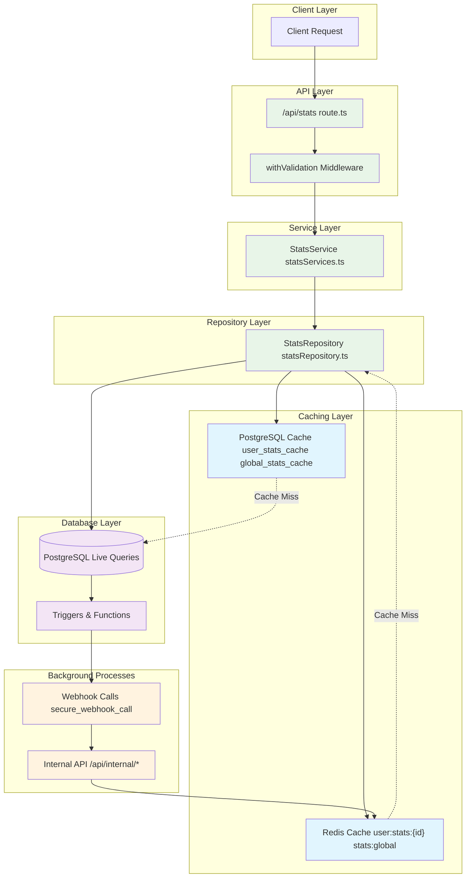
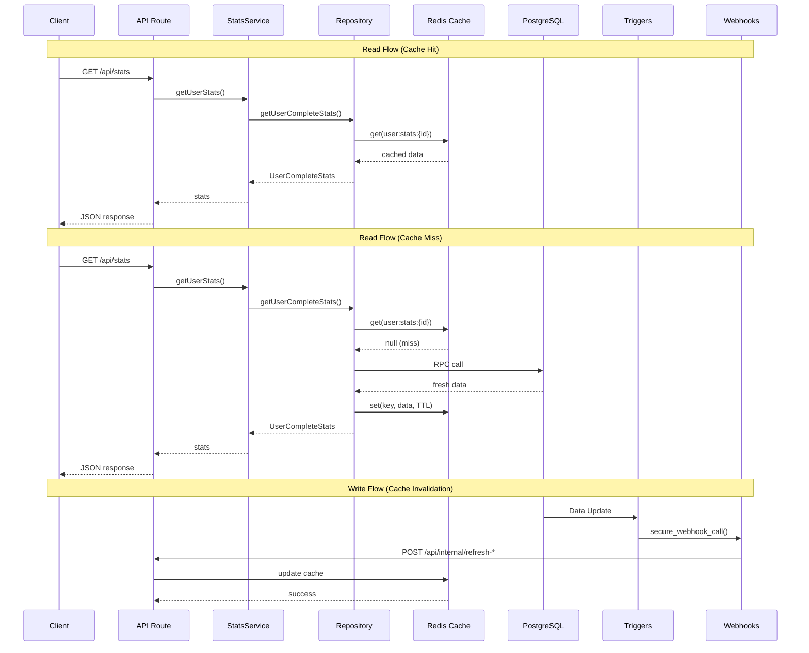
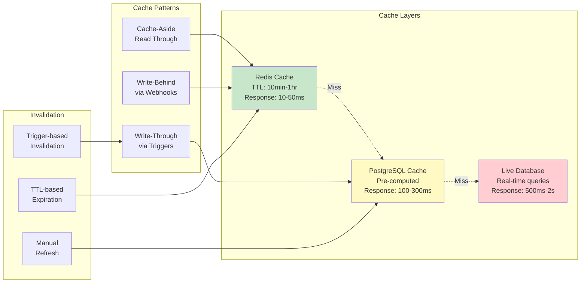

# OpenPortability Stats Architecture

## Overview

The stats system in OpenPortability provides user-specific and global statistics about social media connections and migration progress. It implements a multi-layered caching strategy with Redis and PostgreSQL for optimal performance.

## System Architecture Diagram



## Data Flow Architecture



## Caching Strategy Diagram



## Architecture Components

### 1. API Layer
**File**: `/src/app/api/stats/route.ts`

```typescript
GET /api/stats
```

**Features**:
- **Authentication Required**: Uses `withValidation` middleware with `requireAuth: true`
- **Query Parameter Validation**: Validates URL parameters using `StatsQueryParamsSchema`
- **Onboarding State Handling**: Returns empty stats for non-onboarded users without Twitter ID
- **Error Handling**: Comprehensive logging and graceful error responses

**Flow**:
1. Validates session and authentication
2. Checks onboarding status
3. Extracts and validates query parameters (e.g., `limit`)
4. Delegates to `StatsService.getUserStats()`
5. Returns JSON response with user statistics

### 2. Service Layer
**File**: `/src/lib/services/statsServices.ts`

```typescript
class StatsService {
  async getGlobalStats(): Promise<GlobalStats>
  async getUserStats(userId: string, has_onboard: boolean): Promise<UserCompleteStats>
  async getReconnectionStats(): Promise<ReconnectionStats>
  async refreshUserStats(userId: string, has_onboard: boolean): Promise<void>
  async refreshGlobalStats(): Promise<void>
}
```

**Responsibilities**:
- **Business Logic Layer**: Orchestrates data retrieval and transformation
- **Repository Abstraction**: Delegates data operations to `StatsRepository`
- **Data Transformation**: Converts repository data to service-specific formats
- **Cache Management**: Triggers cache refresh operations

### 3. Repository Layer
**File**: `/src/lib/repositories/statsRepository.ts`

```typescript
class StatsRepository {
  // Core Stats Methods
  async getUserCompleteStats(userId: string, has_onboard: boolean): Promise<UserCompleteStats>
  async getGlobalStats(): Promise<GlobalStats>
  
  // Cache Management
  async getGlobalStatsFromCache(): Promise<GlobalStats | null>
  async refreshUserStatsCache(userId: string, has_onboard: boolean): Promise<void>
  async refreshGlobalStatsCache(): Promise<void>
  
  // Individual Counters
  async getFollowersCount(): Promise<PostgrestSingleResponse<CountResponse>>
  async getFollowingCount(): Promise<PostgrestSingleResponse<CountResponse>>
  async getSourcesCount(): Promise<{ count: number }>
  async getTargetsWithHandleCount(): Promise<PostgrestSingleResponse<CountResponse>>
  async getPlatformMatchesCount(userId: string): Promise<PostgrestSingleResponse<PlatformMatchesCount>>
}
```

**Caching Strategy**:
- **Redis First**: Always tries Redis cache before database
- **Cache-Aside Pattern**: Updates cache after database operations
- **Fallback Mechanism**: Graceful degradation to database if Redis unavailable
- **TTL Management**: Different TTL for user stats (10 min) vs global stats (1 hour)

## Database Schema

### 1. Global Stats Cache Table
```sql
Table "public.global_stats_cache"
┌────────────┬──────────────────────────┬─────────────┬──────────┐
│ Column     │ Type                     │ Nullable    │ Default  │
├────────────┼──────────────────────────┼─────────────┼──────────┤
│ id         │ boolean                  │ NOT NULL    │ true     │
│ stats      │ jsonb                    │ NULL        │          │
│ updated_at │ timestamp with time zone │ NULL        │ now()    │
└────────────┴──────────────────────────┴─────────────┴──────────┘

Constraints:
- PRIMARY KEY: id
- CHECK CONSTRAINT: single_row (id) - Ensures only one row exists
```

**Purpose**: Stores pre-computed global statistics for the entire platform

### 2. User Stats Cache Table
```sql
Table "public.user_stats_cache"
┌────────────┬──────────────────────────┬─────────────┬─────────────┐
│ Column     │ Type                     │ Nullable    │ Default     │
├────────────┼──────────────────────────┼─────────────┼─────────────┤
│ user_id    │ uuid                     │ NOT NULL    │             │
│ stats      │ jsonb                    │ NOT NULL    │ '{}'::jsonb │
│ updated_at │ timestamp with time zone │ NULL        │ now()       │
└────────────┴──────────────────────────┴─────────────┴─────────────┘

Indexes:
- PRIMARY KEY: user_id
- INDEX: idx_user_stats_cache_updated_at (updated_at)

Foreign Keys:
- fk_user: user_id → "next-auth".users(id) ON DELETE CASCADE
- user_stats_cache_user_id_fkey: user_id → "next-auth".users(id) ON DELETE CASCADE

Triggers:
- user_stats_cache_redis_refresh: AFTER INSERT OR UPDATE
  → refresh_user_stats_redis_trigger()
```

**Purpose**: Stores per-user statistics with automatic Redis synchronization

## PostgreSQL Functions & Triggers

### 1. User Stats Cache Refresh Function
```sql
refresh_user_stats_cache(p_user_id uuid) → void
```

**Logic**:
1. **Count Followers**: `SELECT COUNT(*) FROM sources_followers WHERE source_id = p_user_id`
2. **Count Following**: `SELECT COUNT(*) FROM sources_targets WHERE source_id = p_user_id`
3. **Bluesky Stats**: JOIN `sources_targets` with `nodes` on `node_id = twitter_id`
   - Filter: `bluesky_handle IS NOT NULL`
   - Aggregate: `total`, `hasFollowed`, `notFollowed`
4. **Mastodon Stats**: JOIN `sources_targets` with `nodes` on `node_id = twitter_id`
   - Filter: `mastodon_username IS NOT NULL`
   - Aggregate: `total`, `hasFollowed`, `notFollowed`
5. **UPSERT**: Insert or update `user_stats_cache` with computed stats

**JSON Structure**:
```json
{
  "connections": {
    "followers": 150,
    "following": 300
  },
  "matches": {
    "bluesky": {
      "total": 45,
      "hasFollowed": 20,
      "notFollowed": 25
    },
    "mastodon": {
      "total": 30,
      "hasFollowed": 15,
      "notFollowed": 15
    }
  },
  "updated_at": "2025-08-13T13:12:28Z"
}
```

### 2. Redis Synchronization Trigger
```sql
refresh_user_stats_redis_trigger() → trigger
```

**Trigger**: `user_stats_cache_redis_refresh`
- **Events**: AFTER INSERT OR UPDATE ON `user_stats_cache`
- **Execution**: FOR EACH ROW

**Logic**:
1. **Webhook Call**: `secure_webhook_call('http://app:3000/api/internal/refresh-user-stats-cache', payload)`
2. **Payload**: 
   ```json
   {
     "user_id": "uuid",
     "stats": { /* complete stats object */ },
     "updated_at": "timestamp"
   }
   ```
3. **Error Handling**: Logs warnings but doesn't block main transaction
4. **Security**: Uses HMAC signature via `secure_webhook_call`

### 3. Onboarding Trigger
```sql
update_source_targets_on_onboard() → trigger
```

**Trigger**: Applied to `"next-auth".users` table
- **Events**: AFTER UPDATE
- **Condition**: `OLD.has_onboarded = FALSE AND NEW.has_onboarded = TRUE`

**Logic**:
1. **Detection**: User completes onboarding (`has_onboarded` FALSE → TRUE)
2. **Cache Refresh**: Calls `refresh_user_stats_cache(NEW.id)`
3. **Logging**: Comprehensive logs for monitoring

## Caching Architecture

### 1. Redis Cache Strategy

**Global Stats**:
- **Key**: `stats:global`
- **TTL**: 3900 seconds (65 minutes)
- **Update**: Proactive via PostgreSQL cron → webhook
- **Pattern**: Cache-aside with proactive refresh

**User Stats**:
- **Key**: `user:stats:{userId}`
- **TTL**: 600 seconds (10 minutes)
- **Update**: Reactive via database triggers → webhook
- **Pattern**: Cache-aside with trigger-based invalidation

### 2. Cache Flow Patterns

**Read Pattern**:
```
1. Check Redis cache
2. If HIT → Return cached data
3. If MISS → Query database
4. Cache result in Redis
5. Return data
```

**Write Pattern**:
```
1. Update database
2. Trigger fires → webhook call
3. API endpoint updates Redis
4. Next read serves from cache
```

### 3. Fallback Strategy

**Redis Unavailable**:
- **Detection**: Connection timeout or Redis errors
- **Action**: Direct database queries
- **Logging**: Warning logs for monitoring
- **Recovery**: Automatic retry on next request

## Data Flow

### 1. User Stats Request Flow
```
Client Request
    ↓
API Route (/api/stats)
    ↓
withValidation Middleware
    ↓
StatsService.getUserStats()
    ↓
StatsRepository.getUserCompleteStats()
    ↓
┌─ Redis Cache (user:stats:{userId}) ─┐
│  ├─ HIT → Return cached data        │
│  └─ MISS → Continue to database     │
└─────────────────────────────────────┘
    ↓
PostgreSQL Query
    ├─ has_onboarded=false → get_user_complete_stats_from_sources()
    └─ has_onboarded=true → get_user_complete_stats()
    ↓
Cache Result in Redis (TTL: 10min)
    ↓
Return to Client
```

### 2. Cache Invalidation Flow
```
Database Update (sources_followers/sources_targets)
    ↓
refresh_user_stats_cache() called
    ↓
user_stats_cache table updated
    ↓
refresh_user_stats_redis_trigger() fires
    ↓
secure_webhook_call() → /api/internal/refresh-user-stats-cache
    ↓
Redis cache updated (user:stats:{userId})
    ↓
Next request serves fresh data from cache
```

## Update Triggers

### 1. Onboarding Completion
**Trigger Point**: User finishes onboarding (`has_onboarded` FALSE → TRUE)
**Action**: `refresh_user_stats_cache(user_id)`
**Purpose**: Pre-compute stats for newly onboarded users

### 2. Follow Success
**Trigger Point**: `send_follow` API call succeeds
**Action**: `refresh_user_stats_cache(user_id)` 
**Purpose**: Update follow counts after successful reconnections

### 3. Data Import
**Trigger Point**: Bulk import of Twitter data completes
**Action**: Stats triggers on `sources_followers`/`sources_targets` tables
**Purpose**: Refresh stats after new data is imported

## Performance Characteristics

### 1. Cache Hit Rates
- **Global Stats**: ~95% (long TTL, infrequent changes)
- **User Stats**: ~80% (shorter TTL, more dynamic)

### 2. Response Times
- **Cache Hit**: 10-50ms
- **Cache Miss**: 500ms-2s (database query)
- **Redis Unavailable**: 500ms-2s (direct database)

### 3. Scalability
- **Concurrent Users**: Supports 100-1000 simultaneous users
- **Database Load**: 70-90% reduction via caching
- **Memory Usage**: ~1KB per cached user stats

## Dark Areas & Considerations

### 1. **Potential Race Conditions**
- **Issue**: Multiple simultaneous updates to `user_stats_cache` could trigger multiple Redis webhook calls
- **Mitigation**: PostgreSQL transaction isolation + idempotent webhook endpoint
- **Monitoring**: Check for duplicate Redis updates in logs

### 2. **Cache Consistency**
- **Issue**: Redis and PostgreSQL cache tables could become inconsistent
- **Risk**: Webhook failures or Redis downtime during updates
- **Mitigation**: TTL ensures eventual consistency + fallback to database

### 3. **Webhook Reliability**
- **Issue**: `secure_webhook_call` failures could leave Redis stale
- **Risk**: Users see outdated stats until cache expires
- **Monitoring**: Track webhook success rates in PostgreSQL logs

### 4. **Memory Usage**
- **Issue**: Redis memory consumption grows with user base
- **Current**: ~30KB users × 1KB stats = ~30MB
- **Scaling**: Need monitoring and potential key eviction policies

### 5. **Database Connection Pool**
- **Issue**: High concurrent stats requests could exhaust connections
- **Risk**: Database timeouts during peak usage
- **Mitigation**: Connection pooling + Redis caching reduces DB load

### 6. **Trigger Performance**
- **Issue**: Heavy stats computation in triggers could slow down writes
- **Risk**: Import operations become slower due to stats refresh
- **Consideration**: Async stats updates vs real-time accuracy trade-off

### 7. **Cross-Table Dependencies**
- **Issue**: Stats depend on `sources_*`, `nodes`, and `"next-auth".users` tables
- **Risk**: Schema changes could break stats calculations
- **Monitoring**: Need integration tests for stats accuracy

## Monitoring & Observability

### 1. **Key Metrics**
- Redis cache hit/miss rates
- Database query response times
- Webhook success/failure rates
- Stats computation accuracy

### 2. **Logging Points**
- Cache hits/misses (currently commented out for performance)
- Redis connection failures
- Webhook call results
- Database query errors

### 3. **Health Checks**
- Redis connectivity
- Database function availability
- Cache consistency validation
- Stats computation accuracy

This architecture provides a robust, scalable stats system with multi-layer caching and automatic invalidation, designed to handle the growth from current 35K users to target 100K+ users.
