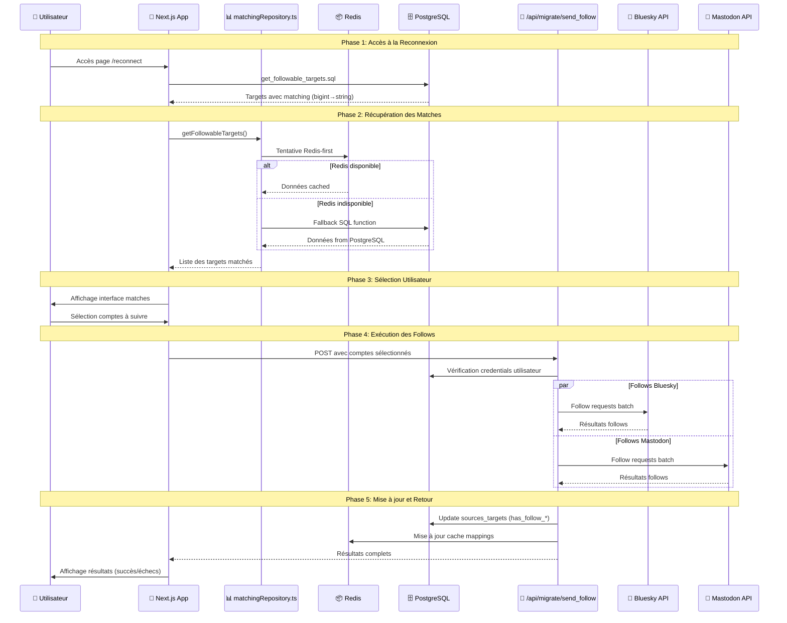
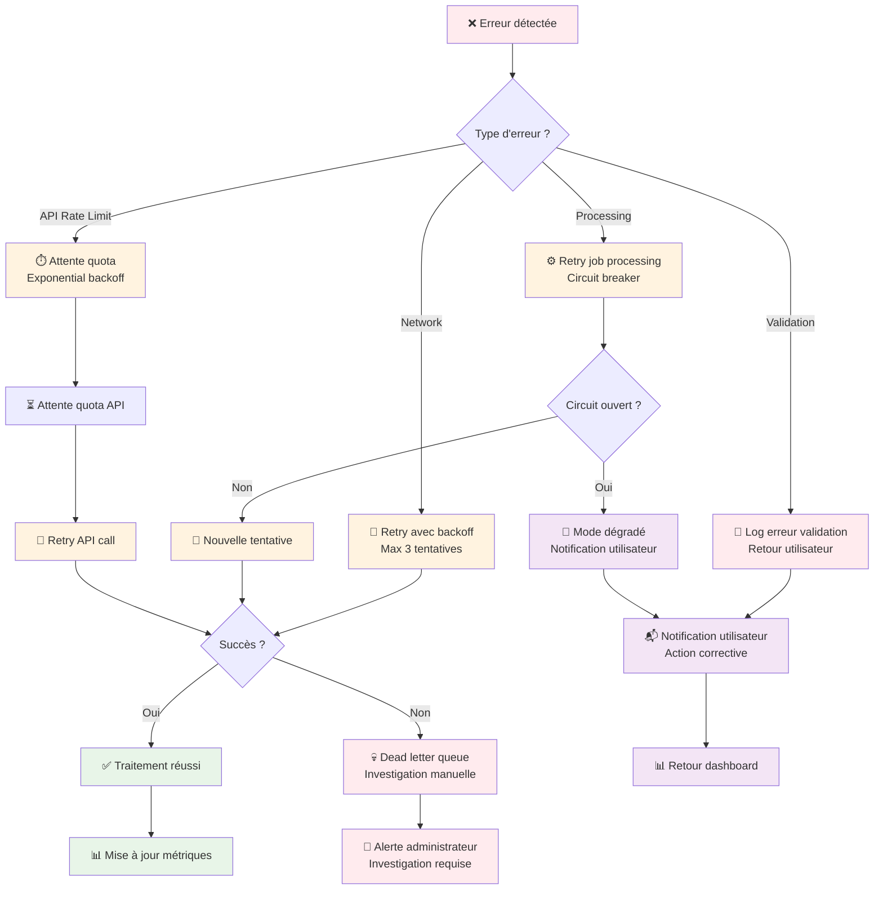
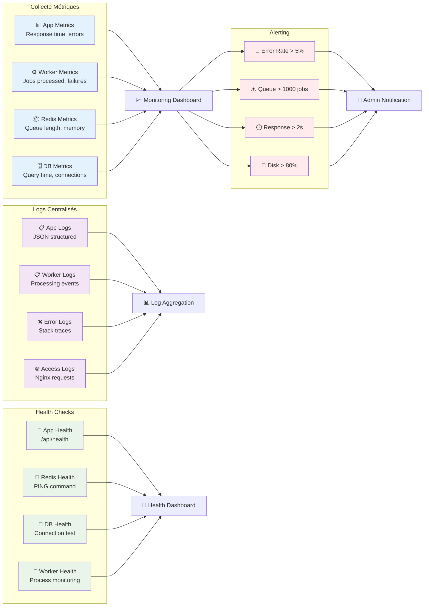
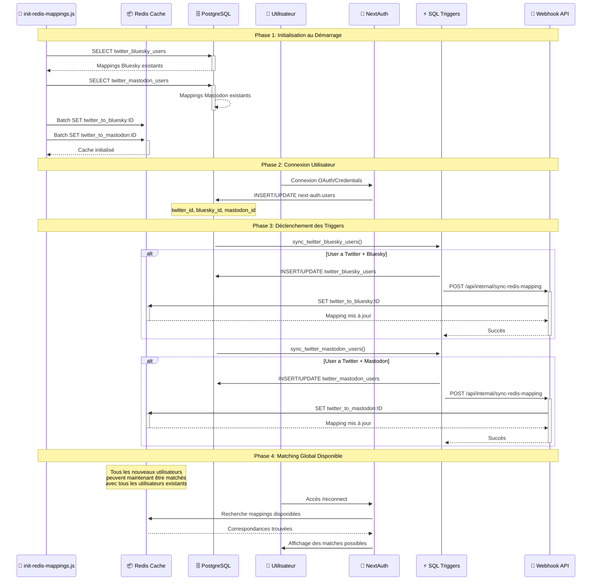

# Workflows Détaillés - OpenPortability

## 1. Workflow Utilisateur Principal

```mermaid
flowchart TD
    Start([👤 Utilisateur visite le site]) --> Auth{Authentifié ?}
    
    Auth -->|Non| Login[🔐 Page de connexion<br/>NextAuth + Supabase]
    Auth -->|Oui| CheckOnboard{Onboardé ?}
    
    Login --> AuthChoice{Type d'auth ?}
    AuthChoice -->|Twitter/Mastodon| OAuthProvider[🔐 OAuth Provider<br/>Twitter ou Mastodon<br/>Interface selon auth.config.ts]
    AuthChoice -->|Bluesky| BlueskyCredentials[🦋 Credentials Bluesky<br/>Handle + App Password]
    
    OAuthProvider --> OAuthProfile[📝 Récupération profil OAuth<br/>ID, username, image, instance]
    BlueskyCredentials --> BlueskyProfile[📝 Récupération profil Bluesky<br/>DID, handle, image]
    
    OAuthProfile --> UpdateUsers[🔄 Update next-auth.users<br/>Colonnes spécifiques par provider]
    BlueskyProfile --> UpdateUsers2[🔄 Update next-auth.users<br/>bluesky_id, bluesky_username, bluesky_image]
    
    UpdateUsers --> TriggerSync[⚡ Triggers automatiques<br/>sync_twitter_bluesky_users<br/>sync_twitter_mastodon_users]
    UpdateUsers2 --> TriggerSync
    
    TriggerSync --> UpdateCache[📦 Update Cache Redis<br/>Mappings automatiques]
    UpdateCache --> CheckOnboard
    
    CheckOnboard -->|Non onboardé| Dashboard[📊 Dashboard<br/>Utilisateurs sans archive<br/>ou sans 3 services]
    CheckOnboard -->|Onboardé| CheckArchiveOrTwitter{Archive ou Twitter ?}
    
    CheckArchiveOrTwitter -->|Oui| Reconnect[🔄 Page /reconnect<br/>Reconnexion automatique]
    CheckArchiveOrTwitter -->|Non| Dashboard
    
    Dashboard --> Import{Import Twitter ?}
    Import -->|Oui| Upload[📁 Upload archive Twitter<br/>.zip ou .tar.gz]
    Import -->|Non| Connect[🔗 Connecter autres comptes]
    
    Upload --> Validate[✅ Validation du fichier]
    Validate -->|Erreur| UploadError[❌ Erreur d'upload<br/>Format invalide]
    Validate -->|OK| Queue[⏳ Ajout à la file d'attente]
    
    UploadError --> Upload
    Queue --> Processing[⚙️ Traitement en cours<br/>Worker indexation]
    
    Processing --> CreateSource[📊 Création Source<br/>Archive Twitter uploadée]
    CreateSource --> ExtractNodes[🕸️ Extraction Nodes<br/>Utilisateurs de l'archive]
    ExtractNodes --> CreateTargets[🎯 Création Sources_targets<br/>Comptes suivis]
    CreateTargets --> CreateFollowers[👥 Création Sources_followers<br/>Comptes qui suivent]
    
    CreateFollowers --> Progress{Statut ?}
    Progress -->|En cours| Wait[⏱️ Attente<br/>Polling status]
    Progress -->|Terminé| Complete[✅ Import terminé]
    Progress -->|Erreur| ProcessError[❌ Erreur de traitement]
    
    Wait --> Progress
    ProcessError --> Retry{Retry ?}
    Retry -->|Oui| Queue
    Retry -->|Non| Dashboard
    
    Complete --> Reconnect
    Connect --> AddService{Ajouter service ?}
    AddService -->|Oui| AuthChoice
    AddService -->|Non| CheckArchiveOrTwitter
    
    Reconnect --> GetFollowable[🔍 get_followable_targets.sql<br/>Récupération followings<br/>avec matching]
    GetFollowable --> MatchingRepo[📊 matchingRepository.ts<br/>Traitement des données<br/>pour le front]
    MatchingRepo --> DisplayMatches[📱 Affichage des matches<br/>Interface utilisateur]
    
    DisplayMatches --> SelectFollows[👆 Sélection des comptes<br/>à suivre/reconnecter]
    SelectFollows --> SendFollow[🚀 /api/migrate/send_follow<br/>Exécution des follows<br/>Bluesky + Mastodon]
    
    SendFollow --> FollowResults[✅ Résultats des follows<br/>Succès/Échecs]
    FollowResults --> Stats[📈 Mise à jour statistiques]
    Stats --> Dashboard
    
    classDef userAction fill:#e3f2fd
    classDef systemProcess fill:#f3e5f5
    classDef decision fill:#fff3e0
    classDef error fill:#ffebee
    classDef database fill:#e8f5e8
    classDef trigger fill:#fce4ec
    classDef reconnect fill:#e8f5e8
    
    class Start,Upload,Connect,SelectFollows,DisplayMatches userAction
    class Queue,Processing,CreateSource,ExtractNodes,CreateTargets,CreateFollowers,GetFollowable,MatchingRepo,SendFollow systemProcess
    class Auth,AuthChoice,CheckOnboard,Import,Progress,Retry,AddService,CheckArchiveOrTwitter decision
    class UploadError,ProcessError error
    class UpdateUsers,UpdateUsers2,UpdateCache database
    class TriggerSync trigger
    class Reconnect,FollowResults,Stats reconnect
```

## 2. Workflow des Données (Data Pipeline)

```mermaid
flowchart LR
    subgraph "Client Phase"
        FileUpload["📁 Upload fichier Twitter<br/>zip ou tar.gz"]
        ClientUnzip["📂 Dézip côté client<br/>@zip.js/zip.js"]
        ClientValidation["✅ Validation côté client<br/>validateTwitterData"]
    end
    
    subgraph "API Phase"
        APIUpload["🚀 /api/upload/large-files<br/>Création tâche DB + Redis"]
        TempStorage["💾 Stockage /app/tmp<br/>Fichiers extraits"]
        JobCreation["📋 Création import_jobs<br/>+ Redis queue"]
    end
    
    subgraph "Worker Phase"
        WorkerConsume["⚙️ worker/src/index.ts<br/>BRPOP Redis"]
        CSVDump["📄 Dump CSV depuis stdin<br/>Tables temporaires"]
        NodesInsert["🕸️ Insertion Nodes<br/>Utilisateurs extraits"]
        SourcesInsert["🎯 Insertion Sources_targets<br/>+ Sources_followers"]
    end
    
    subgraph "Completion Phase"
        WorkerComplete["✅ Worker set completed<br/>Statut job terminé"]
        OnboardTrigger["⚡ has_onboarded = true<br/>Trigger user_onboard_trigger"]
        StatsRefresh["📊 update_source_targets_on_onboard<br/>refresh_user_stats_cache"]
    end
    
    subgraph "Reconnect Phase"
        GetFollowable["🔍 get_followable_targets.sql<br/>Cast bigint→string"]
        MatchingRepo["📊 matchingRepository.ts<br/>Redis-first + SQL fallback"]
        FrontDisplay["📱 Affichage matches<br/>Interface utilisateur"]
    end
    
    FileUpload --> ClientUnzip
    ClientUnzip --> ClientValidation
    ClientValidation -->|Valid| APIUpload
    ClientValidation -->|Invalid| Error1["❌ Erreur validation client"]
    
    APIUpload --> TempStorage
    APIUpload --> JobCreation
    JobCreation --> WorkerConsume
    
    WorkerConsume --> CSVDump
    CSVDump --> NodesInsert
    NodesInsert --> SourcesInsert
    
    SourcesInsert --> WorkerComplete
    WorkerComplete --> OnboardTrigger
    OnboardTrigger --> StatsRefresh
    OnboardTrigger --> GetFollowable
    
    GetFollowable --> MatchingRepo
    MatchingRepo --> FrontDisplay
    
    classDef client fill:#e3f2fd
    classDef api fill:#fff3e0
    classDef worker fill:#e8f5e8
    classDef completion fill:#f3e5f5
    classDef reconnect fill:#fce4ec
    
    class FileUpload,ClientUnzip,ClientValidation client
    class APIUpload,TempStorage,JobCreation api
    class WorkerConsume,CSVDump,NodesInsert,SourcesInsert worker
    class WorkerComplete,OnboardTrigger,StatsRefresh completion
    class GetFollowable,MatchingRepo,FrontDisplay reconnect
```

## 3. Workflow de Migration des Données

## 4. Workflow de Gestion des Erreurs

## 5. Workflow de Monitoring et Observabilité

## 6. Workflow des Mappings d'Identités

### Détails du Workflow des Mappings

#### 🚀 **Phase 1: Initialisation Redis**
- **Script** : `redis/init-redis-mappings.js`
- **Déclenchement** : Au démarrage de l'application
- **Action** : Chargement en masse des mappings existants depuis PostgreSQL vers Redis
- **Format clés** : `twitter_to_bluesky:123456789`, `twitter_to_mastodon:123456789`

#### 🔐 **Phase 2: Mise à jour Utilisateur**
- **Trigger** : Connexion ou mise à jour de profil utilisateur
- **Table** : `next-auth.users` (colonnes twitter_id, bluesky_id, mastodon_id)
- **Contraintes** : Une seule connexion Twitter par utilisateur (unique constraint)

#### ⚡ **Phase 3: Synchronisation Automatique**
- **Triggers PostgreSQL** :
  - `sync_twitter_bluesky_users_string.sql`
  - `sync_twitter_mastodon_users_string.sql`
- **Action** : Mise à jour des tables de mapping + appel webhook
- **Webhook** : `/api/internal/sync-redis-mapping` pour actualiser Redis

#### 🎯 **Phase 4: Matching Global**
- **Bénéfice** : Chaque nouvel utilisateur peut être matché avec tous les utilisateurs existants
- **Performance** : Recherche ultra-rapide via Redis cache
- **Fallback** : PostgreSQL en cas d'indisponibilité Redis

## Optimisations et Bonnes Pratiques

### Performance
- **Batch Processing**: Traitement par lots pour réduire la charge DB
- **Connection Pooling**: Pool de connexions PostgreSQL
- **Redis Pipelining**: Commandes groupées pour Redis
- **Lazy Loading**: Chargement différé des données volumineuses

### Fiabilité
- **Circuit Breaker**: Protection contre les cascades d'erreurs
- **Retry Logic**: Tentatives avec backoff exponentiel
- **Dead Letter Queue**: Gestion des jobs irrécupérables
- **Health Checks**: Surveillance continue des services

### Sécurité
- **Input Validation**: Validation stricte des données
- **Rate Limiting**: Protection contre les abus
- **Secrets Management**: Variables d'environnement sécurisées
- **Network Isolation**: Réseaux Docker séparés

### Scalabilité
- **Horizontal Scaling**: Multiplication des workers
- **Load Balancing**: Distribution via Nginx
- **Cache Strategy**: Stratégie de cache multi-niveaux
- **Database Sharding**: Partitionnement si nécessaire
